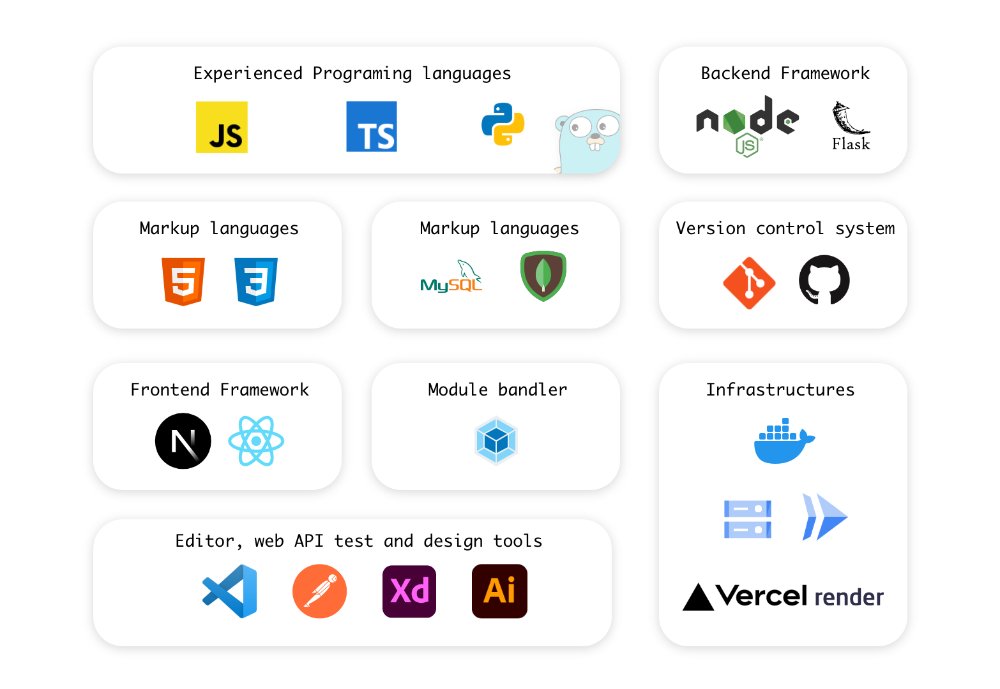

# 職務経歴書

---

## プロフィール

### 基本情報

| key      | value                                |
| -------- | ------------------------------------ |
| 氏名     | 中野 陽仁(Nakano Akihito)            |
| 生年月日 | 1986/08/03                           |
| 居住地   | 大阪                                 |
| 最終学歴 | 兵庫県立大学経済学部　応用経済学科卒 |

### SNS

- [twitter](https://twitter.com/aki_composite)
- [github](https://github.com/AkihitoNakano)

### 開発環境

#### 使用マシン

| key                 | value                                                                            |
| ------------------- | -------------------------------------------------------------------------------- |
| mac mini (M1, 2020) | web アプリケーションの開発は mac を使用                                          |
| windows 10          | mac 購入以前の開発は、windows を使用、主に python を使ったソフトウェアの開発経験 |

#### 使用ツール

- vscode
- pycharm
- postman
- mogngoDB compass
- TablePlus
- Adobe XD / Illustrator / Photoshop / AfterEffects

---

## スキル

#### TypeScript / Node.js / Next.js / React / MongoDB

##### WEB アプリケーションの開発

##### フロントエンド

- Next.js/TypeScript を使用し動的な UI を構築できる
- useState や react-hook-form を使用しログイン、サインアップの機能を作ることができる
- カスタムフックを独自に定義して無限スクロールを作ることができる
- createPortal を使用してモーダルを表示することができる
- useContext, createContext を使用してエラーなどの情報を表示するトーストを作ることができる
- 単体の画像ファイルの読み込みとブラウザへの表示を作ることができる
- ローディング中の表示を作ることができる
- バックエンドから返ってきた token をクライアント側で cookie としてセットする。また token 情報を header にセットしてバックエンドに送信送信する処理を記述することができる
- テンプレートエンジン hbs/handlebars を使用した開発経験がある

##### バックエンド

- Node.js とフレームワーク Express を使用してバックエンドの CRUD 操作を行う API を開発できる
- mongoDB の Aggregation パイプラインを使用し、一度のクエリ文で必要な情報を取得することができる
- Node.js 内で JWT の認証とパスワードの hash 化を実装することができる
- Jest, supertest を使用して api 通信を行なったテストコードを書くことができる
- ログイン、サインアップの機能を実装できる
- token の有無によってルーティングを変更するミドルウェアを作ることができる
- DB の設計書からスキーマ、モデルを Mongoose を使って記述することが出来る
- クラスを使用して汎用性のあるエラーのハンドリングの処理を作ることができる
- Next.js または Node.js から GCP の Cloud Storage へファイルを保存、更新、削除する API を記述することができる

#### Python / Flask / SQLite

##### 主に CLI アプリの開発

- Flask と SQLite3 を用いて DB に保存した文章を Twitter に投稿する Bot を開発
- 複数の画像をスプライトシートにして出力する CLI アプリケーションを開発
- csv データを SQL に挿入できるコードに変換する CLI アプリの開発
- mp3 の音声データを wav に変換する CLI アプリの開発
- csv から読み込んだ内容を指定時間にツイートする CLI アプリの開発

### その他スキル

#### Docker

- Dockerfile を作って node の開発環境を構築することができる
- docker-compose ファイルを開発環境と本番環境用に分けて作ることができる
- Dockerfile または docker-compose ファイルから指定のポート番号でアプリを立ち上げることができる
- Docker ファイルを使って Cloud Run にデプロイすることができる

#### GCP / Cloud Run/ Cloud Storage/ Container Registry / Cloud Build

- Cloud Storage へのファイル保存、編集、削除の API を作成することができる
- Node で作成したアプリを gcloud build コマンドで Container Registry にイメージを保存し、Cloud Run へデプロイすることができる
- Github に push または pull request から Cloud Run へと継続的デプロイを行うことができる

#### Git / Github

- プルリクエストの作成とマージを行うワークフローの経験（個人開発のみ)

#### 全般

- わからないことやエラー、バグを調べて解決する、または代替策を考えることができる

#### 勉強中の言語

- GO

---

### 個人開発詳細

#### 料理レシピ作成アプリ GOOD FOOD (2022/09 - 2022/10 月末)

WEB サイト
👉 https://good-food-one.vercel.app/

解説ページ、リポジトリ
👉 https://github.com/AkihitoNakano/GoodFood-Portfolio

料理のレシピを作成し、複数のレシピをまとめて一つの A4 ページに印刷できるアプリを開発。
アプリケーションの内容は妻に随時チェックしてもらい使いやすいアプリになるように改善を加えていきました。

- **主な実装内容**
  - サインアップ、ログイン、ログアウト、アカウント削除
  - JWT を使用したユーザー認証
  - プロフィールの編集、パスワード、email などのアカウント情報の変更
  - レシピの検索
  - レシピの投稿、編集、削除、お気に入りに登録、削除
  - レシピへのコメントと返信
  - 他ユーザーのフォロー機能
  - ページ（複数のレシピをまとめる）機能、ページの印刷
  - メール認証
  - Cloud Storage への画像ファイル保存
  - パスワードの hash 化
  - Jest, supertest を使用したテストコードの作成
  - デバッグ用のルーティング、コードの作成
  - レスポンシブ、モバイル対応
