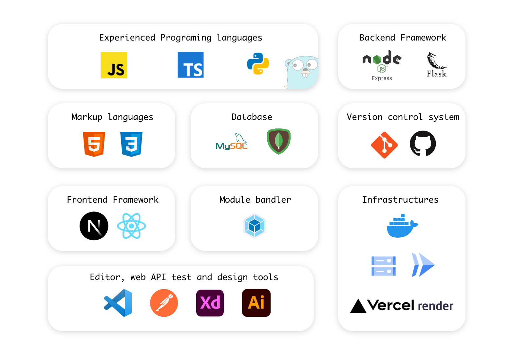
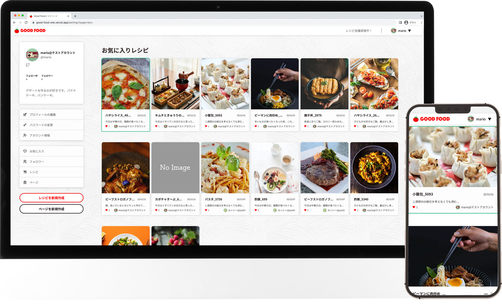
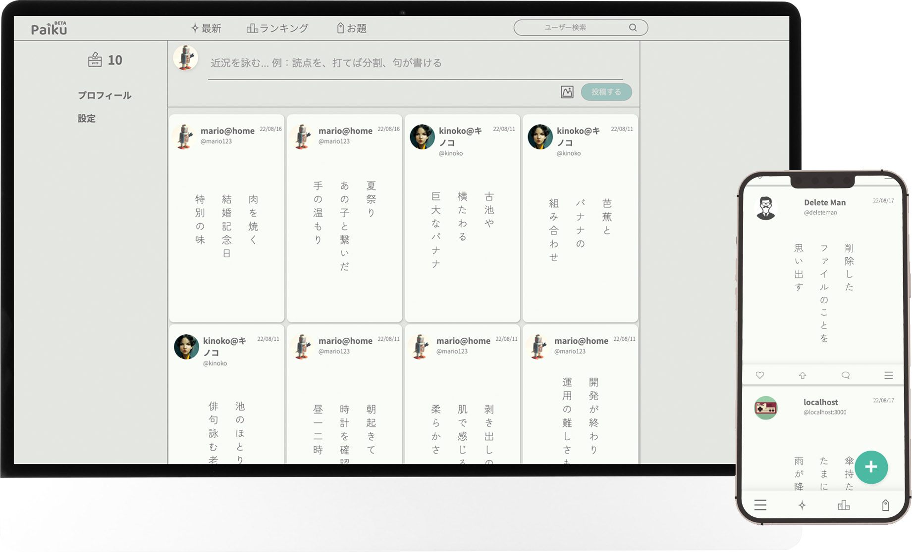
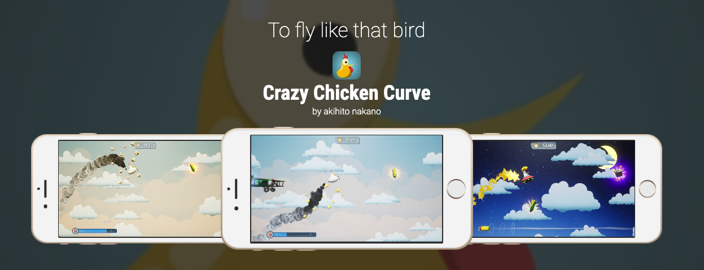

# 職務経歴書

---

## プロフィール

### 基本情報

| key      | value                                |
| -------- | ------------------------------------ |
| 氏名     | 中野 陽仁(Nakano Akihito)            |
| 生年月日 | 1986/08/03                           |
| 居住地   | 大阪                                 |
| 最終学歴 | 兵庫県立大学経済学部　応用経済学科卒 |

### SNS

- [twitter](https://twitter.com/aki_composite)
- [github](https://github.com/AkihitoNakano)

### 開発環境

#### 使用マシン

- **mac mini (M1, 2020)**

  - web アプリケーションの開発は mac を使用

- **windows 10**
  - mac 購入以前の開発は、windows を使用、主に python を使ったソフトウェアの開発経験

---

## スキル

### TypeScript / Node.js / Next.js / React / MongoDB

#### WEB アプリケーションの開発

##### フロントエンド

- Next.js/TypeScript を使用し動的な UI を構築できる
- useState や react-hook-form を使用しログイン、サインアップの機能を作ることができる
- カスタムフックを独自に定義して無限スクロールを作ることができる
- createPortal を使用してモーダルを表示することができる
- useContext, createContext を使用してエラーなどの情報を表示するトーストを作ることができる
- 単体の画像ファイルの読み込みとブラウザへの表示を作ることができる
- ローディング中の表示を作ることができる
- バックエンドから返ってきた token をクライアント側で cookie としてセットする。また token 情報を header にセットしてバックエンドに送信送信する処理を記述することができる
- テンプレートエンジン hbs/handlebars を使用した開発経験がある

##### バックエンド

- Node.js とフレームワーク Express を使用してバックエンドの CRUD 操作を行う API を開発できる
- mongoDB の Aggregation パイプラインを使用し、一度のクエリ文で必要な情報を取得することができる
- Node.js 内で JWT の認証とパスワードの hash 化を実装することができる
- Jest, supertest を使用して api 通信を行なったテストコードを書くことができる
- ログイン、サインアップの機能を実装できる
- token の有無によってルーティングを変更するミドルウェアを作ることができる
- DB の設計書からスキーマ、モデルを Mongoose を使って記述することが出来る
- クラスを使用して汎用性のあるエラーハンドリングの処理を作ることができる
- Next.js または Node.js から GCP の Cloud Storage へファイルを保存、更新、削除する API を記述することができる

### Python / Flask / SQLite

#### 主に CLI アプリの開発

- Flask と SQLite3 を用いて DB に保存した文章を Twitter に投稿する Bot を開発
- 複数の画像をスプライトシートにして出力する CLI アプリケーションを開発
- csv データを SQL に挿入できるコードに変換する CLI アプリの開発
- mp3 の音声データを wav に変換する CLI アプリの開発
- csv から読み込んだ内容を指定時間にツイートする CLI アプリの開発

### その他スキル

#### Docker

- Dockerfile を作って node の開発環境を構築することができる
- docker-compose ファイルを開発環境と本番環境用に分けて作ることができる
- Dockerfile または docker-compose ファイルから指定のポート番号でアプリを立ち上げることができる
- Docker ファイルを使って Cloud Run にデプロイすることができる

#### GCP / Cloud Run/ Cloud Storage / Container Registry / Cloud Build

- Cloud Storage へのファイル保存、編集、削除の API を作成することができる
- Node で作成したアプリを gcloud build コマンドで Container Registry にイメージを保存し、Cloud Run へデプロイすることができる
- Github に push または pull request から Cloud Run へと継続的デプロイを行うことができる

#### Git / Github

- プルリクエストの作成とマージを行うワークフローの経験（個人開発のみ)

#### 全般

- わからないことやエラー、バグを調べて解決する、または代替策を考えることができる

#### 勉強中の技術

- GO
- postgres

 

---

### ウェブアプリケーション個人開発

 

### 料理レシピ作成アプリ GOOD FOOD (2022/09 - 2022/10 月末)

WEB サイト

👉 https://good-food-one.vercel.app/

解説ページ、git リポジトリ

👉 https://github.com/AkihitoNakano/GoodFood-Portfolio

料理のレシピを投稿したり編集できるアプリケーションを開発しました。お気に入りに登録したレシピは印刷してノートに貼り付け使用できるように印刷用のレイアウトを工夫しました。

 

- **主な実装内容**
  - サインアップ、ログイン、ログアウト、アカウント削除
  - JWT を使用したユーザー認証
  - プロフィールの編集、パスワード、email などのアカウント情報の変更
  - レシピの検索
  - レシピの投稿、編集、削除、お気に入りに登録、削除
  - レシピへのコメントと返信
  - 他ユーザーのフォロー機能
  - ページ（複数のレシピをまとめる）機能、ページの印刷
  - メール認証
  - Cloud Storage への画像ファイル保存
  - パスワードの hash 化
  - Jest, supertest を使用したテストコードの作成
  - デバッグ用のルーティング、コードの作成
  - レスポンシブ、モバイル対応

 

### 俳句、川柳、575 が投稿できる SNS Web アプリケーション(2022/06 - 2022/08)

WEB サイト

👉 https://paiku575.com

解説ページ、git リポジトリ

👉 https://github.com/AkihitoNakano/Portfolio-Paiku575

このアプリは俳句や川柳、575 などの句を投稿し、いいねや返信をすることで他のユーザと交流ができる SNS アプリケーションです。Twitter の俳句版をイメージして開発しました。

 

- **主な実装内容**
  - 句、画像の投稿
  - タグの挿入と検索
  - ユーザー検索
  - プロフィールの更新、削除
  - お気に入りの登録
  - ユーザーのフォロー
  - 句カードへの投票、投票回数のリセット
  - 句への返信
  - 句カードの Twitter への共有
  - アカウント情報の更新と削除
  - ランキング機能
  - タグの一覧表示
  - メール認証
  - Cloud Storage への画像ファイルの保存
  - パスワードの hash 化
  - パスワードを忘れた際の再登録メール送信処理
  - JWT トークンによる自動ログイン
  - web hook を使用して問い合わせ内容を Discord に転送
  - レスポンシブ対応

 

#### タイピングゲーム (2022/05 -　 2 週間程度)

プログラミング言語の単語のみを取り扱うタイピングゲームです。
選択できる言語は JavaScript, python, HTML/CSS 。

- vanilla JavaScript とテンプレートエンジン hbs を使用してフロントエンドの開発
- バックエンドは Node.js とデータベースに mongoDB Atlas を使用
- 単語をデータベースに保管し、クライアントのリクエストで DB から取り出しクライアントに送信
- 単語の追加はルーティングを用いる方法と CSV から複数単語を追加する方法を作成
- Heroku へのデプロイ（現在は停止中です）

 

### ゲーム開発

**UNREAL ENGINE** を使用したアマチュアのゲーム開発を個人で 5 年ほど経験しております。

#### iOS スマートフォンゲーム 「Crazy Chicken Curve」

卵型飛行機に乗った鶏が、飛んでくるミサイルを避けて飛行時間を競うシンプルなゲームです。
現在は公開の期限が切れているため非公開となっております。

https://appadvice.com/app/crazy-chicken-curve/1566090087

 

---

### 職務履歴詳細

映画、TV、ゲーム映像の業界で日本(東京)で 5 年間、台湾で 2 年間そして大阪で在宅勤務のフリーランスとして 5 年間 Adobe AfterEffects や Foundry Nuke を用いた合成やエフェクト制作の実務実績がございます。媒体は主に国内の実写映画が中心で、映画が 40 作品以上、TV10 作品程度、遊技機・ゲーム案件を 10 作品程度経験しておりま
す。

東京在住時は 3 年に渡り 2 校の CG デザイン専門学校で NUKE の講師を担当致しました。

台湾では新会社の立ち上げに携わり、プロデュースやディレクションだけでなく台湾の若者の教育にも力を注ぎました。

#### 実制作業務

#### 株式会社 Spade & Co. (在宅フリーランス)(2018 年 1 月~2022 年 3 月)

- コンピューターグラフィックスの作成

**【職務内容】**

- VFX コンポジッター : 実写映画、TV ドラマの合成。

【作品実績(一部)】
|年度|メディア|タイトル|
|---|-------|-------|
|2018 |Web 映像|Sick's|
|2018 |映画|Sick's|
|2018 |映画|マスカレードホテル|
|2018 |映画|銀魂２|
|2019 |映画|億男|
|2019 |映画|ニセコイ|
|2019 |映画|春待つ僕ら|
|2019 |映画|凪待ち|
|2019 |映画|キングダム|
|2020 |映画|一度死んでみた|
|2020 |映画|駅までの道を教えて|
|2020 |映画|最高の人生の見つけ方|
|2020 |映画|十二単の悪魔|
|2020 |映画|屍人荘の殺人|
|2020 |映画|るろうに剣心 the begining|
|2020 |映画|奥様は取扱注意|
|2020 |映画|十二単の悪魔|
|2020 |映画|騙し絵の牙|
|2020 |映画|ヒノマルソウル|
|2020 |映画|ファブル 2|
|2021 |映画|孤狼の血 2|
|2021 |映画|全裸監督 2|
|2021 |映画|かぐや様は告らせたい 2|
|2022 |映画|キングダム 2|

 
***

#### 有限会社ソリッデザイン(台湾)(2015 年 5 月~2017 年 1 月)

- 従業員数 6 名 各種映像の企画製作、ポスプロ作業。VFX・遊技機・CG アニメーション。

**【職務内容】**

・VFX ディレクター 実写映画、TV ドラマの合成、遊技機関連の案件受託のプロデュースからディレクション、マネージメント、実作業 まで幅広く担当。

【作品実績(一部)】
|年度|メディア|タイトル|
|---|-------|-------|
|2017 |映画|牙狼[GARO] 神の牙-KAMINOKIBA-|
|2017 |映画|ひるなかの流星|
|2016 |映画|咲 Saki|
|2016 |映画|恋妻家宮本|
|2016 |映画|MUSEUM|
|2016 |映画|HiGH & LOW Red Rain|
|2016 |映画|HiGH & LOW|
|2017 |TV|CODE: MIRAGE|
|2016 |TV|GARO 魔界列伝|
|2015 |TV|GARO Gold Storm|
|2015 |TV|GARO バレリーノ|

**【アピールポイント】**

主に日本企業からの受託案件に関して企画、プロデュースから管理、実製作まで一括して責任を負う立場でした。
社内チームの体制づくりや品質管理を中心とし、社内の新人を現場で活躍できるよう教育してきました。

 
***

#### フリーランス(出向型 VFX アーティスト)(2011 年 11 月~2015 年 4 月)株式会社オムニバスジャパン、株式会社 Spade & Co.

- コンピューターグラフィックスの作成

**【職務内容】**
・VFX コンポジッター 実写映画、TV ドラマの合成、遊技機関連のゲームムービーの合成とエフェクト作成。

【作品実績(一部)】
|年度|メディア|タイトル|
|---|-------|-------|
|2015 |映画|HERO|
|2015 |映画|天空の蜂|
|2015 |映画|進撃の巨人 Attack On Titan 前編|
|2015 |映画|脳内ポイズンベリー|
|2014 |映画|THE NEXT GENERATION パトレイバー|
|2014 |映画|牙狼 GARO 蒼哭ノ魔竜|
|2013 |TV|GARO 魔界の花|
|2012 |TV|GARO 闇を照らす者|
|2012 |TV|GARO 魔界戦記|
|2012 |TV|ブラックボード|

**【アピールポイント】**
出向タイプのフリーランスとして活動。チームの中心として、関わった作品の重要なシーンのテンプレートやツールを作る作業を行いました。

 
***

#### 有限会社マリンポスト(2010 年 8 月~2011 年 10 月)

- 資本金 300 万円 従業員数 15 名 各種映像の企画製作、ポスプロ作業。VFX・映画用タイトル・CG アニメーション

**【職務内容】**
・VFX コンポジッター 実写映画、TV ドラマの合成、遊技機関連のゲームムービーの合成とエフェクト作成。

【作品実績(一部)】
|年度|メディア|タイトル|
|---|-------|-------|
|2011 |映画|カイジ 2 人生奪回ゲーム|
|2011 |映画|ステキな金縛り|
|2011 |映画|八日目の蝉|
|2011 |映画|アンダルシア|
|2011 |映画|ひみつのアッコちゃん|
|2011 |映画|怪物くん|
|2011 |映画|ゴースト|
|2011 |TV|ニセ医者と呼ばれて|
|2011 |TV|この世界の片隅に|

**【アピールポイント】**

一年半の期間で複数の映画案件の合成作業を担当。カイジ 2 では社内唯一のコンポジッターとして一人で 50 カット 以上担当、のぼうの城では最後の重要なカットの合成を任せていただきました。

 
***

### 人材育成　講師業務

#### 学校法人 OCA 大阪デザイン＆テクノロジー専門学校(2017/4 - 2022/3)

非常勤講師

- ゲームや映像で使用する CG エフェクトのクラスを担当
- 就職活動向けのポートフォリオ、デモリール制作のクラスを担当

#### 学校法人　河原学園　河原デザイン・アート専門学校 (2018/4 - 2021/3)

非常勤講師

- After Effects を使用した映像合成、エフェクトのクラスを担当

#### 株式会社バンタン(2017/10 - 2018/2)

非常勤講師

- After Effects を使用した映像合成、エフェクトのクラスを担当

#### デジタルハリウッド株式会社 (2012/1 - 2014/4)

非常勤講師

- The Foundry Nuke を用いた実写合成に関するクラスを担当

#### 学校法人 専門学校 東京デザイナー学院 (2014/4 - 2015/2)

非常勤講師

- The Foundry Nuke を用いた実写合成に関するクラスを担当
